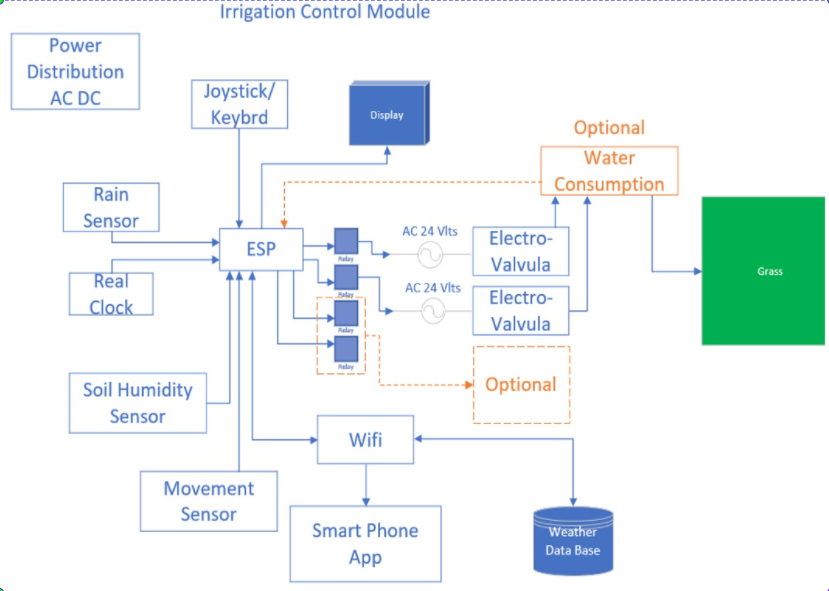

# Irrigation system

## Storage Configuration 

To store the tokens required to connect to the _blynk server_, token and ID required for _telegram_ and the configuration time when the relays should turn on and for how long it uses the EEPROM library, the memorymap is as follow:

<table>
    <thead>
        <tr>
            <th>0</th>
            <th>1</th>
            <th>2</th>
            <th>3</th>
            <th>4</th>
            <th>5</th>
            <th>6</th>
            <th>7</th>
            <th>8</th>
            <th>9</th>
            <th>10</th>
            <th>11</th>
            <th>12</th>
            <th>13</th>
            <th>14</th>
            <th>15</th>
            <th>16</th>
            <th>17</th>
            <th>18</th>
            <th>19</th>
        </tr>
    </thead>
    <tbody>
      <tr>
        <td colspan=10>ChatID</td>
        <td colspan=10>Telegram Token</td>
       </tr>
       <tr>
         <td colspan=20>Telegram Token</td>
       </tr>
       <tr>
         <td colspan=18>Telegram token</td>
         <td colspan=2>Blynk token</td>
       </tr>
       <tr>
         <td colspan=20>Blynk token</td>
       </tr>
       <tr>
         <td colspan=18>Blynk token</td>
         <td colspan=2>padding</td>
       </tr>
       <tr>
         <td colspan=1>Flag</td>
         <td colspan=3>Unused</td>
         <td colspan=8>Configuration relay1</td>
         <td colspan=8>Configuration relay2</td>
       </tr>
       <tr>
         <td colspan=8>Configuration relay3</td>
         <td colspan=8>Configuration relay4</td>
       </tr>
   </tbody>
</table>

where the configuration per each relay is:

<table>
    <thead>
        <tr>
            <th>0</th>
            <th>1</th>
            <th>2</th>
            <th>3</th>
            <th>4</th>
            <th>5</th>
            <th>6</th>
            <th>7</th>
        </tr>
    </thead>
    <tbody>
      <tr>
        <td colspan=1>Hour</td>
        <td colspan=1>Min</td>
        <td colspan=1>Seg</td>
        <td colspan=1>Dur1</td>
        <td colspan=1>Dur2</td>
         <td colspan=1>Dur3</td>
         <td colspan=1>Dur4</td>
         <td colspan=1>Days</td>
       </tr>
   </tbody>
</table>

